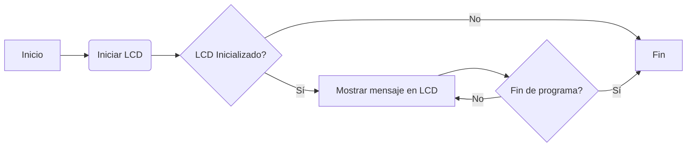
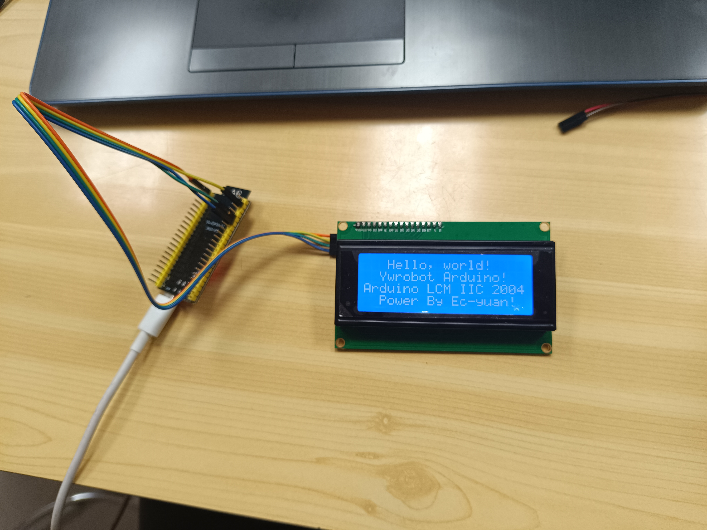

# P5.B. I2C: LEDs organicos
## Objetivo: 
- El objetivo de la practica es comprender el funcionamiento de los buses sistemas de comunicación entre
periféricos; estos elementos pueden ser internos o externos al procesador.
- Mostrar por una pantalla de leds organicos un mensaje.
## Materiales: 
- ESP32-S3
- Display oled I2C SSD1306 OLED
- Librerias: 
```
    lib_deps = 
	    marcoschwartz/LiquidCrystal_I2C@^1.1.4
```
## Procedimiento: 
**Código:**
```cpp
    #include <LiquidCrystal_I2C.h>

    LiquidCrystal_I2C lcd(0x27,20,4);  // set the LCD address to 0x27 for a 16 chars and 2 line display

    void setup()
    {
    Wire.begin(5,6);
    lcd.init();                      // initialize the lcd 
    // Print a message to the LCD.
    lcd.backlight();
    lcd.setCursor(3,0);
    lcd.print("Hello, world!");
    lcd.setCursor(2,1);
    lcd.print("Ywrobot Arduino!");
    lcd.setCursor(0,2);
    lcd.print("Arduino LCM IIC 2004");
    lcd.setCursor(2,3);
    lcd.print("Power By Ec-yuan!");
    }


    void loop()
    {
    }
```
**Descripción:**<br>
El código proporcionado inicializa un objeto de la clase ``LiquidCrystal_I2C`` para controlar un LCD con interfaz I2C. <br>
En la función ``setup()``, se inicia la comunicación I2C y se inicializa el LCD con ``lcd.init()``. Luego se enciende la retroiluminación del LCD con lcd.backlight(). A continuación, se utiliza ``lcd.setCursor()`` para establecer la posición del cursor en el LCD y lcd.print() para imprimir mensajes en cada una de las cuatro líneas del LCD.

### Mensaje imprimido en los LEDs organicos:
```
    Hello, world!
    Ywrobot Arduino!
    Arduino LCM IIC 2004
    Power By Ec-yuan!
```
### Diagrama de flujos:


### Foto del resultado: 
 <br>

## Conclusión:
Inicializa un LCD con interfaz I2C y muestra un mensaje diferente en cada línea del LCD. Es un ejemplo básico de cómo utilizar el LCD con una interfaz I2C en un proyecto de Arduino.


